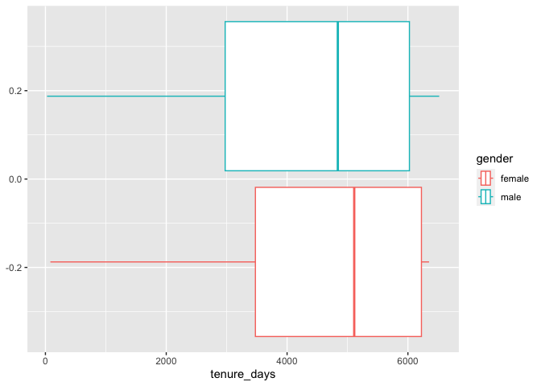
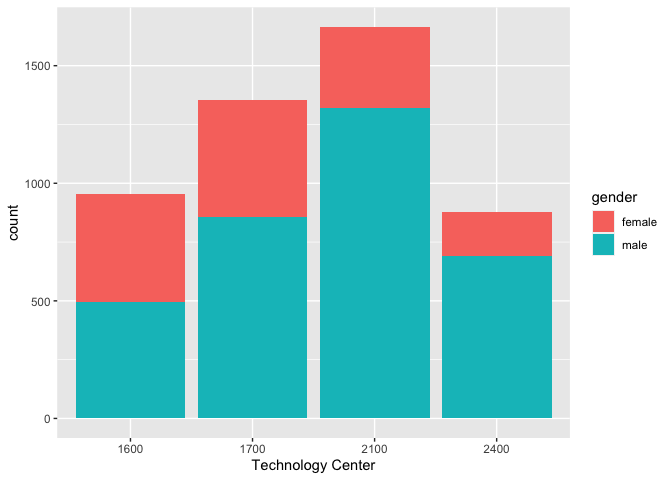
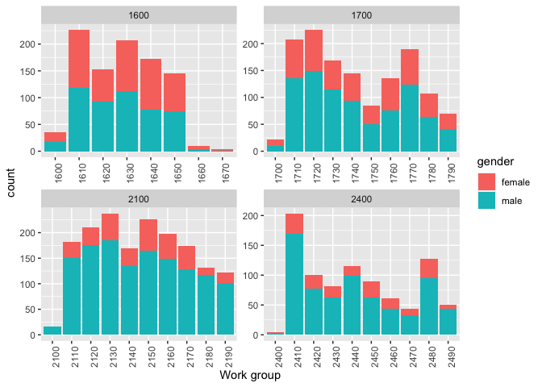

Exercise 4
================

## Setting up data and environment

We first need to do a few things before we can manipulate the data.

``` r
# set path for R to find our data
data_path = "~/Dropbox/McGill/teaching/2022-2023/ORGB671/data/"
```

## Objectives

1.  Research how the composition of and art unit at time t affects
    likelihood of examiner transition to another art unit at time t+1

- Consider different aspects of the composition: size, gender ratio,
  race representation, seniority distribution of peers
- Optionally, consider different (heterogeneous) effects by focal
  examiner’s gender, race and seniority
- Clearly explain your causal model, the assumptions it depends on and
  the limitations of your inference

2.  Find a factor that may be considered exogenous (i.e., random) and
    improve your inference

- Use Diff-in-diff or IV, as you wish
- Clearly explain the logic of your research design
- Hints: other people’s moves may be exogenous; workload may be
  exogenous; types of applicants are exogenous because of random
  assignment of applications to examiners

## 1. Load data

We’ll load application data only here (you are welcome to load the other
three files as well). Because we are loading from a .parquet format
file, we’ll use library `arrow` and the functions `read_parquet()`. For
the rest of the files, we can use function `read_csv()` which comes with
a package `readr` (which is included in `tidyverse` set of packages, so
if we are loading `tidyverse` there is no need to also load `readr`).
Note that the path to the data file on my computer is defined above, in
the `data_path` variable.

``` r
library(arrow) # to be able to load data in the .parquet format
```

    ## 
    ## Attaching package: 'arrow'

    ## The following object is masked from 'package:utils':
    ## 
    ##     timestamp

``` r
# read application data
app_data_sample <- read_parquet(paste0(data_path,"app_data_sample.parquet"))
```

To inspect the top slice of the data, we can simply call it:

``` r
app_data_sample
```

    ## # A tibble: 2,018,477 × 16
    ##    applicat…¹ filing_d…² exami…³ exami…⁴ exami…⁵ exami…⁶ exami…⁷ uspc_…⁸ uspc_…⁹
    ##    <chr>      <date>     <chr>   <chr>   <chr>     <dbl>   <dbl> <chr>   <chr>  
    ##  1 08284457   2000-01-26 HOWARD  JACQUE… V         96082    1764 508     273000 
    ##  2 08413193   2000-10-11 YILDIR… BEKIR   L         87678    1764 208     179000 
    ##  3 08531853   2000-05-17 HAMILT… CYNTHIA <NA>      63213    1752 430     271100 
    ##  4 08637752   2001-07-20 MOSHER  MARY    <NA>      73788    1648 530     388300 
    ##  5 08682726   2000-04-10 BARR    MICHAEL E         77294    1762 427     430100 
    ##  6 08687412   2000-04-28 GRAY    LINDA   LAMEY     68606    1734 156     204000 
    ##  7 08716371   2004-01-26 MCMILL… KARA    RENITA    89557    1627 424     401000 
    ##  8 08765941   2000-06-23 FORD    VANESSA L         97543    1645 424     001210 
    ##  9 08776818   2000-02-04 STRZEL… TERESA  E         98714    1637 435     006000 
    ## 10 08809677   2002-02-20 KIM     SUN     U         65530    1723 210     645000 
    ## # … with 2,018,467 more rows, 7 more variables: patent_number <chr>,
    ## #   patent_issue_date <date>, abandon_date <date>, disposal_type <chr>,
    ## #   appl_status_code <dbl>, appl_status_date <chr>, tc <dbl>, and abbreviated
    ## #   variable names ¹​application_number, ²​filing_date, ³​examiner_name_last,
    ## #   ⁴​examiner_name_first, ⁵​examiner_name_middle, ⁶​examiner_id,
    ## #   ⁷​examiner_art_unit, ⁸​uspc_class, ⁹​uspc_subclass

### Get gender for examiners

We’ll get gender based on the first name of the examiner, which is
recorded in the field `examiner_name_first`. We’ll use library `gender`
for that, relying on a modified version of their own
[example](https://cran.r-project.org/web/packages/gender/vignettes/predicting-gender.html).

Note that there are over 2 million records in the applications table –
that’s because there are many records for each examiner, as many as the
number of applications that examiner worked on during this time frame.
Our first step therefore is to get all *unique* names in a separate list
`examiner_names`. We will then guess gender for each one and will join
this table back to the original dataset. So, let’s get names without
repetition:

``` r
library(gender)
#install_genderdata_package() # only run this line the first time you use the package, to get data for it

# get a list of first names without repetitions
examiner_names <- app_data_sample %>% 
  distinct(examiner_name_first)

examiner_names
```

    ## # A tibble: 2,595 × 1
    ##    examiner_name_first
    ##    <chr>              
    ##  1 JACQUELINE         
    ##  2 BEKIR              
    ##  3 CYNTHIA            
    ##  4 MARY               
    ##  5 MICHAEL            
    ##  6 LINDA              
    ##  7 KARA               
    ##  8 VANESSA            
    ##  9 TERESA             
    ## 10 SUN                
    ## # … with 2,585 more rows

Now let’s use function `gender()` as shown in the example for the
package to attach a gender and probability to each name and put the
results into the table `examiner_names_gender`

``` r
# get a table of names and gender
examiner_names_gender <- examiner_names %>% 
  do(results = gender(.$examiner_name_first, method = "ssa")) %>% 
  unnest(cols = c(results), keep_empty = TRUE) %>% 
  select(
    examiner_name_first = name,
    gender,
    proportion_female
  )

examiner_names_gender
```

    ## # A tibble: 1,822 × 3
    ##    examiner_name_first gender proportion_female
    ##    <chr>               <chr>              <dbl>
    ##  1 AARON               male              0.0082
    ##  2 ABDEL               male              0     
    ##  3 ABDOU               male              0     
    ##  4 ABDUL               male              0     
    ##  5 ABDULHAKIM          male              0     
    ##  6 ABDULLAH            male              0     
    ##  7 ABDULLAHI           male              0     
    ##  8 ABIGAIL             female            0.998 
    ##  9 ABIMBOLA            female            0.944 
    ## 10 ABRAHAM             male              0.0031
    ## # … with 1,812 more rows

Finally, let’s join that table back to our original applications data
and discard the temporary tables we have just created to reduce clutter
in our environment.

``` r
# remove extra colums from the gender table
examiner_names_gender <- examiner_names_gender %>% 
  select(examiner_name_first, gender)

# joining gender back to the dataset
app_data_sample <- app_data_sample %>% 
  left_join(examiner_names_gender, by = "examiner_name_first")

# cleaning up
rm(examiner_names)
rm(examiner_names_gender)
gc()
```

    ##            used  (Mb) gc trigger  (Mb) limit (Mb) max used  (Mb)
    ## Ncells  4633338 247.5    7790965 416.1         NA  5081481 271.4
    ## Vcells 49702410 379.2   92749089 707.7      16384 80018245 610.5

### Guess the examiner’s race

We’ll now use package `wru` to estimate likely race of an examiner. Just
like with gender, we’ll get a list of unique names first, only now we
are using surnames.

``` r
library(wru)

examiner_surnames <- app_data_sample %>% 
  select(surname = examiner_name_last) %>% 
  distinct()

examiner_surnames
```

    ## # A tibble: 3,806 × 1
    ##    surname   
    ##    <chr>     
    ##  1 HOWARD    
    ##  2 YILDIRIM  
    ##  3 HAMILTON  
    ##  4 MOSHER    
    ##  5 BARR      
    ##  6 GRAY      
    ##  7 MCMILLIAN 
    ##  8 FORD      
    ##  9 STRZELECKA
    ## 10 KIM       
    ## # … with 3,796 more rows

We’ll follow the instructions for the package outlined here
<https://github.com/kosukeimai/wru>.

``` r
examiner_race <- predict_race(voter.file = examiner_surnames, surname.only = T) %>% 
  as_tibble()
```

    ## Warning: Unknown or uninitialised column: `state`.

    ## Proceeding with last name predictions...

    ## ℹ All local files already up-to-date!

    ## 701 (18.4%) individuals' last names were not matched.

``` r
examiner_race
```

    ## # A tibble: 3,806 × 6
    ##    surname    pred.whi pred.bla pred.his pred.asi pred.oth
    ##    <chr>         <dbl>    <dbl>    <dbl>    <dbl>    <dbl>
    ##  1 HOWARD       0.597   0.295    0.0275   0.00690   0.0741
    ##  2 YILDIRIM     0.807   0.0273   0.0694   0.0165    0.0798
    ##  3 HAMILTON     0.656   0.239    0.0286   0.00750   0.0692
    ##  4 MOSHER       0.915   0.00425  0.0291   0.00917   0.0427
    ##  5 BARR         0.784   0.120    0.0268   0.00830   0.0615
    ##  6 GRAY         0.640   0.252    0.0281   0.00748   0.0724
    ##  7 MCMILLIAN    0.322   0.554    0.0212   0.00340   0.0995
    ##  8 FORD         0.576   0.320    0.0275   0.00621   0.0697
    ##  9 STRZELECKA   0.472   0.171    0.220    0.0825    0.0543
    ## 10 KIM          0.0169  0.00282  0.00546  0.943     0.0319
    ## # … with 3,796 more rows

As you can see, we get probabilities across five broad US Census
categories: white, black, Hispanic, Asian and other. (Some of you may
correctly point out that Hispanic is not a race category in the US
Census, but these are the limitations of this package.)

Our final step here is to pick the race category that has the highest
probability for each last name and then join the table back to the main
applications table. See this example for comparing values across
columns: <https://www.tidyverse.org/blog/2020/04/dplyr-1-0-0-rowwise/>.
And this one for `case_when()` function:
<https://dplyr.tidyverse.org/reference/case_when.html>.

``` r
examiner_race <- examiner_race %>% 
  mutate(max_race_p = pmax(pred.asi, pred.bla, pred.his, pred.oth, pred.whi)) %>% 
  mutate(race = case_when(
    max_race_p == pred.asi ~ "Asian",
    max_race_p == pred.bla ~ "black",
    max_race_p == pred.his ~ "Hispanic",
    max_race_p == pred.oth ~ "other",
    max_race_p == pred.whi ~ "white",
    TRUE ~ NA_character_
  ))

examiner_race
```

    ## # A tibble: 3,806 × 8
    ##    surname    pred.whi pred.bla pred.his pred.asi pred.oth max_race_p race 
    ##    <chr>         <dbl>    <dbl>    <dbl>    <dbl>    <dbl>      <dbl> <chr>
    ##  1 HOWARD       0.597   0.295    0.0275   0.00690   0.0741      0.597 white
    ##  2 YILDIRIM     0.807   0.0273   0.0694   0.0165    0.0798      0.807 white
    ##  3 HAMILTON     0.656   0.239    0.0286   0.00750   0.0692      0.656 white
    ##  4 MOSHER       0.915   0.00425  0.0291   0.00917   0.0427      0.915 white
    ##  5 BARR         0.784   0.120    0.0268   0.00830   0.0615      0.784 white
    ##  6 GRAY         0.640   0.252    0.0281   0.00748   0.0724      0.640 white
    ##  7 MCMILLIAN    0.322   0.554    0.0212   0.00340   0.0995      0.554 black
    ##  8 FORD         0.576   0.320    0.0275   0.00621   0.0697      0.576 white
    ##  9 STRZELECKA   0.472   0.171    0.220    0.0825    0.0543      0.472 white
    ## 10 KIM          0.0169  0.00282  0.00546  0.943     0.0319      0.943 Asian
    ## # … with 3,796 more rows

Let’s join the data back to the applications table.

``` r
# removing extra columns
examiner_race <- examiner_race %>% 
  select(surname,race)

app_data_sample <- app_data_sample %>% 
  left_join(examiner_race, by = c("examiner_name_last" = "surname"))

rm(examiner_race)
rm(examiner_surnames)
gc()
```

    ##            used  (Mb) gc trigger  (Mb) limit (Mb) max used  (Mb)
    ## Ncells  4794019 256.1    7790965 416.1         NA  7790965 416.1
    ## Vcells 54106391 412.8  111378906 849.8      16384 92747492 707.7

### Examiner’s tenure

To figure out the timespan for which we observe each examiner in the
applications data, let’s find the first and the last observed date for
each examiner. We’ll first get examiner IDs and application dates in a
separate table, for ease of manipulation. We’ll keep examiner ID (the
field `examiner_id`), and earliest and latest dates for each application
(`filing_date` and `appl_status_date` respectively). We’ll use functions
in package `lubridate` to work with date and time values.

``` r
library(lubridate) # to work with dates
```

    ## Loading required package: timechange

    ## 
    ## Attaching package: 'lubridate'

    ## The following object is masked from 'package:arrow':
    ## 
    ##     duration

    ## The following objects are masked from 'package:base':
    ## 
    ##     date, intersect, setdiff, union

``` r
examiner_dates <- app_data_sample %>% 
  select(examiner_id, filing_date, appl_status_date) 

examiner_dates
```

    ## # A tibble: 2,018,477 × 3
    ##    examiner_id filing_date appl_status_date  
    ##          <dbl> <date>      <chr>             
    ##  1       96082 2000-01-26  30jan2003 00:00:00
    ##  2       87678 2000-10-11  27sep2010 00:00:00
    ##  3       63213 2000-05-17  30mar2009 00:00:00
    ##  4       73788 2001-07-20  07sep2009 00:00:00
    ##  5       77294 2000-04-10  19apr2001 00:00:00
    ##  6       68606 2000-04-28  16jul2001 00:00:00
    ##  7       89557 2004-01-26  15may2017 00:00:00
    ##  8       97543 2000-06-23  03apr2002 00:00:00
    ##  9       98714 2000-02-04  27nov2002 00:00:00
    ## 10       65530 2002-02-20  23mar2009 00:00:00
    ## # … with 2,018,467 more rows

The dates look inconsistent in terms of formatting. Let’s make them
consistent. We’ll create new variables `start_date` and `end_date`.

``` r
examiner_dates <- examiner_dates %>% 
  mutate(start_date = ymd(filing_date), end_date = as_date(dmy_hms(appl_status_date))) %>% 
  filter(year(end_date)<2018)
```

Let’s now identify the earliest and the latest date for each examiner
and calculate the difference in days, which is their tenure in the
organization.

``` r
examiner_dates <- examiner_dates %>% 
  group_by(examiner_id) %>% 
  summarise(
    earliest_date = min(start_date, na.rm = TRUE), 
    latest_date = max(end_date, na.rm = TRUE),
    tenure_days = interval(earliest_date, latest_date) %/% days(1)
    )

examiner_dates
```

    ## # A tibble: 5,649 × 4
    ##    examiner_id earliest_date latest_date tenure_days
    ##          <dbl> <date>        <date>            <dbl>
    ##  1       59012 2004-07-28    2015-07-24         4013
    ##  2       59025 2009-10-26    2017-05-18         2761
    ##  3       59030 2005-12-12    2017-05-22         4179
    ##  4       59040 2007-09-11    2017-05-23         3542
    ##  5       59052 2001-08-21    2007-02-28         2017
    ##  6       59054 2000-11-10    2016-12-23         5887
    ##  7       59055 2004-11-02    2007-12-26         1149
    ##  8       59056 2000-03-24    2017-05-22         6268
    ##  9       59074 2000-01-31    2017-03-17         6255
    ## 10       59081 2011-04-21    2017-05-19         2220
    ## # … with 5,639 more rows

Joining back to the applications data.

``` r
app_data_sample <- app_data_sample %>% 
  left_join(examiner_dates, by = "examiner_id")

rm(examiner_dates)
gc()
```

    ##            used  (Mb) gc trigger   (Mb) limit (Mb)  max used   (Mb)
    ## Ncells  4801069 256.5   13985047  746.9         NA  13985047  746.9
    ## Vcells 64371793 491.2  133734687 1020.4      16384 133543401 1018.9

## 3. Descriptive statistics

Let’s look at distribution of gender, race and tenure, overall in the
organization, and by technology centers (TCs) and workgroups.

### Overall distributions of gender, race and tenure.

We can we can start with simple frequencies.

``` r
subset_app_data <- app_data_sample %>% 
  mutate(race = as_factor(race), gender = as_factor(gender)) %>% 
  select(gender, race, tenure_days) 

subset_app_data %>% 
  count(gender) %>% 
  mutate(pct = n/sum(n))
```

    ## # A tibble: 3 × 3
    ##   gender       n   pct
    ##   <fct>    <int> <dbl>
    ## 1 female  571227 0.283
    ## 2 male   1143391 0.566
    ## 3 <NA>    303859 0.151

``` r
subset_app_data %>% 
  count(race) %>% 
  mutate(pct = n/sum(n))
```

    ## # A tibble: 5 × 3
    ##   race           n      pct
    ##   <fct>      <int>    <dbl>
    ## 1 white    1276527 0.632   
    ## 2 black      89559 0.0444  
    ## 3 Asian     591644 0.293   
    ## 4 Hispanic   58856 0.0292  
    ## 5 other       1891 0.000937

We can also use library `skimr` to skim the data quickly.

``` r
library(skimr)

subset_app_data %>%  
  skim()
```

|                                                  |            |
|:-------------------------------------------------|:-----------|
| Name                                             | Piped data |
| Number of rows                                   | 2018477    |
| Number of columns                                | 3          |
| \_\_\_\_\_\_\_\_\_\_\_\_\_\_\_\_\_\_\_\_\_\_\_   |            |
| Column type frequency:                           |            |
| factor                                           | 2          |
| numeric                                          | 1          |
| \_\_\_\_\_\_\_\_\_\_\_\_\_\_\_\_\_\_\_\_\_\_\_\_ |            |
| Group variables                                  | None       |

Data summary

**Variable type: factor**

| skim_variable | n_missing | complete_rate | ordered | n_unique | top_counts                                        |
|:--------------|----------:|--------------:|:--------|---------:|:--------------------------------------------------|
| gender        |    303859 |          0.85 | FALSE   |        2 | mal: 1143391, fem: 571227                         |
| race          |         0 |          1.00 | FALSE   |        5 | whi: 1276527, Asi: 591644, bla: 89559, His: 58856 |

**Variable type: numeric**

| skim_variable | n_missing | complete_rate |    mean |      sd |  p0 |  p25 |  p50 |  p75 | p100 | hist  |
|:--------------|----------:|--------------:|--------:|--------:|----:|-----:|-----:|-----:|-----:|:------|
| tenure_days   |         0 |             1 | 5531.37 | 1100.91 |  27 | 4962 | 6090 | 6336 | 6518 | ▁▁▁▂▇ |

### Plot tenure by gender and TCs

We will use `ggplot` package to plot our distributions. It’s the most
widely used and the most flexible plotting package. Watch a tutorial
here: <https://youtu.be/h29g21z0a68>.

First, we need to keep one observation per person, to avoid the same
person contributing to the plot multiple times because they appear in
the data for multiple applications.

``` r
person_level_data <- app_data_sample %>% 
  group_by(examiner_id) %>% 
  summarise(
    art_unit = min(examiner_art_unit, na.rm = TRUE),
    gender = min(gender, na.rm = TRUE),
    start_year = min(year(earliest_date), na.rm = TRUE),
    latest_date = max(latest_date, na.rm = TRUE),
    tenure_days = max(tenure_days, na.rm = TRUE)
  ) %>% 
  mutate(
    tc = floor(art_unit/100)*100,
    work_group = floor(art_unit/10)*10
  ) %>% 
  filter(!is.na(gender)) # dropping all records where we don't know the gender

person_level_data
```

    ## # A tibble: 4,849 × 8
    ##    examiner_id art_unit gender start_year latest_date tenure_days    tc work_g…¹
    ##          <dbl>    <dbl> <chr>       <dbl> <date>            <dbl> <dbl>    <dbl>
    ##  1       59012     1716 male         2004 2015-07-24         4013  1700     1710
    ##  2       59025     2465 male         2009 2017-05-18         2761  2400     2460
    ##  3       59040     1724 female       2007 2017-05-23         3542  1700     1720
    ##  4       59052     2138 male         2001 2007-02-28         2017  2100     2130
    ##  5       59055     2165 male         2004 2007-12-26         1149  2100     2160
    ##  6       59056     2124 male         2000 2017-05-22         6268  2100     2120
    ##  7       59081     2489 male         2011 2017-05-19         2220  2400     2480
    ##  8       59086     2487 female       2010 2017-05-18         2527  2400     2480
    ##  9       59096     1612 male         2000 2015-11-20         5800  1600     1610
    ## 10       59117     2439 male         2009 2011-09-02          925  2400     2430
    ## # … with 4,839 more rows, and abbreviated variable name ¹​work_group

We start by plotting boxplots for tenure. A simple boxplot for the
entire sample looks like this

``` r
ggplot(person_level_data) +
  geom_boxplot(aes(x = tenure_days, color = gender))
```

<!-- -->

Now let’s plot gender composition by TC. Note that I am conversing the
numerical variable `tc` into a factor variable, so that ggplot
understands it’s just a label for the Technology Center, not an actual
measure of something and so intelligently adjusts the x-axis.

``` r
ggplot(person_level_data) +
  geom_bar(
    aes(x=as_factor(tc), fill = gender), 
    position = position_stack()
    ) +
  xlab("Technology Center")
```

<!-- -->

### Tiling multiple plots

Let’s plot gender composition by work group for each TC. See this page
for documentation:
<https://ggplot2.tidyverse.org/reference/facet_wrap.html>

``` r
ggplot(person_level_data) +
  geom_bar(
    aes(x=as_factor(work_group), fill = gender), 
    position = position_stack()
    ) +
  xlab("Work group") +
  theme(axis.text.x = element_text(angle = 90, vjust = 1, hjust=1)) + #rotate labels
  facet_wrap(vars(tc), scales = "free")
```

<!-- -->
